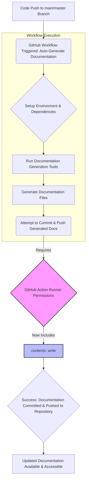

# Technical Documentation Update

## 1. Summary of Changes

A new permission, `contents: write`, has been explicitly added to the `Auto-Generate Documentation` GitHub Actions workflow configuration file (`.github/workflows/auto-docs.yml`).

## 2. Rationale for the Change

The `Auto-Generate Documentation` workflow is designed to automate the process of generating and updating technical documentation. For this workflow to successfully commit new or updated documentation files back into the repository (e.g., using an action like `git-auto-commit-action` or similar for updating `gh-pages` branches), it requires explicit write permissions to the repository's contents.

Without the `permissions: contents: write` declaration, the GitHub Actions runner would lack the necessary authorization to modify files within the repository. This would typically lead to workflow failures when attempting to push changes, commit new files, or update existing documentation artifacts. This change resolves such permission issues, enabling the automated documentation process to function as intended by persisting its generated output.

## 3. Updated API Documentation (Spring Boot)

*This change is exclusively related to the CI/CD pipeline's configuration within GitHub Actions and does not affect the Spring Boot application's API code, functionality, or deployment artifacts directly. Therefore, no updates to Spring Boot API documentation are required or provided in this context.*

## 4. Updated Architectural Explanation

This update enhances the robustness and self-sufficiency of our continuous documentation delivery pipeline. The `Auto-Generate Documentation` workflow is a cornerstone of our architecture for maintaining living documentation, ensuring that our technical guides, references, and diagrams remain synchronized with the latest codebase.

With the introduction of `permissions: contents: write`, the workflow is now fully authorized to perform its complete lifecycle:
1.  **Triggering:** On specified events (e.g., pushes to `main` or `master` branches).
2.  **Execution:** Running documentation generation tools and scripts.
3.  **Persistence:** Successfully committing and pushing the newly generated or updated documentation files back into the repository.

This capability is crucial for closing the feedback loop on automated documentation. It ensures that any changes to the source code that might affect documentation are automatically reflected in the accessible documentation artifacts without requiring manual intervention, thereby promoting a "docs-as-code" philosophy and ensuring documentation remains accurate and up-to-date.

## 5. Architectural Flow: Automated Documentation Generation

The following diagram illustrates the updated flow of our automated documentation generation process, highlighting the critical role of the `contents: write` permission.

